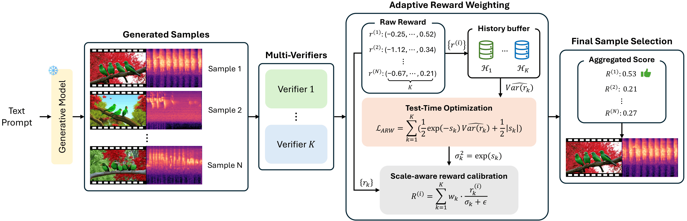

# <div align="center">🎬 JavisDiT-ITS: Inference Time Scaling for Joint Audio-Video Generation</div>

<div align="center">

**[Jaemin Jung](https://jung-jaemin.github.io/)**<sup>1</sup> • [Kyeongha Rho](https://kyeongharho.github.io/)<sup>1</sup> • [Inkyu Shin](https://dlsrbgg33.github.io/)<sup>2</sup> • [Joon Son Chung](https://mm.kaist.ac.kr/joon/)<sup>1</sup>

<sup>1</sup> [KAIST](https://www.kaist.ac.kr/) | <sup>2</sup> [Luma AI](https://lumalabs.ai/)

<br>

[](https://arxiv.org/abs/2606.03183)
[](https://jung-jaemin.github.io/ITS-AVGen-Proj/)
[](https://github.com/kaistmm/ITS-AVGen)

</div>

---

<p align="center">
  
</p>

---

## 📋 Table of Contents

- [🎬 JavisDiT-ITS: Inference Time Scaling for Joint Audio-Video Generation](#-javisdit-its-inference-time-scaling-for-joint-audio-video-generation)
  - [📋 Table of Contents](#-table-of-contents)
  - [📋 Overview](#-overview)
  - [✨ Key Features](#-key-features)
  - [🎬 Supported Models](#-supported-models)
  - [🚀 Getting Started](#-getting-started)
    - [Installation](#installation)
      - [Step 1: Setup Environment](#step-1-setup-environment)
      - [Step 2: Setup Reward Server](#step-2-setup-reward-server)
      - [Step 3: Verification](#step-3-verification)
  - [📖 Usage Guide](#-usage-guide)
    - [Standard Inference (No ITS)](#standard-inference-no-its)
    - [With Reward Models (BON or EvoSearch)](#with-reward-models-bon-or-evosearch)
  - [⚙️ Configuration](#️-configuration)
    - [Reward Models (Verifiers)](#reward-models-verifiers)
    - [Evolution Settings](#evolution-settings)
    - [Score Aggregation Methods](#score-aggregation-methods)
  - [📊 Evaluation](#-evaluation)
  - [📚 Citation](#-citation)
  - [🔗 References](#-references)

---

## 📋 Overview

<p align="center">
  <a href="assets/src/main.pdf" target="_blank">
    
  </a>
</p>

**Inference Time Scaling (ITS)** extends generation quality without retraining by leveraging pre-trained reward models at inference time.

Rather than generating a single sample through the diffusion process, ITS generates a population of diverse candidates and uses reward signals (video quality, audio-video synchronization, etc.) to iteratively refine them.

**How it works:**
1. Generate diverse candidates through diffusion
2. Score each candidate using reward signals
3. Iteratively refine the best candidates
4. Return the highest-quality sample

---

## ✨ Key Features

| Feature | Description |
|---------|-------------|
| 🚀 **No Retraining** | Works with any pre-trained JavisDiT model out-of-the-box |
| 🎯 **BON (Best-of-N)** | Generate N candidates and select the best using reward ranking |
| 🧬 **EvoSearch** | Evolutionary refinement through multiple denoising stages |
| 📊 **Multi-Reward** | Combine VideoReward, JavisScore, CLAP, and more |
| 🔧 **Flexible Config** | Fine-tune all parameters via Python configuration |
| 💾 **Memory Efficient** | Sequential processing modes for large populations |

---

## 🎬 Supported Models

| Model | Type | Features |
|-------|------|----------|
| **[JavisDiT-ITS](https://github.com/kaistmm/ITS-AVGen)** ⭐ | Joint Audio-Video DiT | Synchronized generation with spatio-temporal priors |
| **[LTX2-ITS](https://github.com/kaistmm/ITS-AVGen-LTX2)** | Most Powerful | SOTA quality & synchronization, production-ready |
| **[MMDisCo-ITS](https://github.com/SonyResearch/MMDisCo)** | Coming Soon | Discriminator-guided multimodal generation |

> 📖 For JavisDiT base model details, refer to [JavisDiT repository](https://github.com/JavisVerse/JavisDiT).

---

## 🚀 Getting Started

### Installation

#### Step 1: Setup Environment

```bash
git clone https://github.com/kaistmm/ITS-AVGen.git
cd ITS-AVGen

# Create conda environment
conda create -n javisdit_its python=3.10
conda activate javisdit_its

# Install core dependencies
conda install -c conda-forge ffmpeg cuda-toolkit=12.1 -y
pip install -r requirements/requirements-cu121.txt
pip install -r requirements/requirements.txt

# Important: setuptools version for pkg_resources compatibility
pip install "setuptools<81" --force-reinstall

# Install JavisDiT-ITS
pip install -v -e .
```

#### Step 2: Setup Reward Server

We recommend creating a separate environment for reward models to use across multiple generation models (JavisDiT, LTX2, etc.). However, you can also work within a single environment if preferred.

```bash
# Setup VideoAlign environment
cd VideoAlign
conda env create -f environment.yaml
conda activate VideoReward
pip install flash-attn==2.5.8 --no-build-isolation
cd ..

# Install additional dependencies
pip install "setuptools<81" --force-reinstall
pip install git+https://github.com/facebookresearch/ImageBind.git

# Download model checkpoints
mkdir -p checkpoints
cd checkpoints
git clone https://huggingface.co/KwaiVGI/VideoReward
wget https://dl.fbaipublicfiles.com/imagebind/imagebind_huge.pth -O imagebind_huge.pth
cd ..
```

#### Step 3: Verification

Test your installation:

```bash
# Terminal 1: Start reward server (if using ITS)
conda activate VideoReward
bash vqa_server.sh 0
# ✓ Should output: "Server started... Listening for requests."

# Terminal 2: Run test inference
conda activate javisdit_its
python scripts/inference.py configs/javisdit-v0-1/inference/sample_240p4s_standard.py \
    --prompt "a cat playing with a ball in a sunny garden" \
    --num-frames 2s --resolution 240p --aspect-ratio 9:16 \
    --save-dir samples/test_output --verbose 2
```

✅ If both complete successfully, installation is complete!

---

## 📖 Usage Guide

### Standard Inference (No ITS)

Generate without reward-based selection:

```bash
conda activate javisdit_its

python scripts/inference.py \
    configs/javisdit-v0-1/inference/sample_240p4s_standard.py \
    --prompt "your prompt here" \
    --num-frames 2s --resolution 240p --aspect-ratio 9:16 \
    --save-dir samples/output
```

### With Reward Models (BON or EvoSearch)

Requires reward server running:

```bash
# Terminal 1: Start reward server
conda activate VideoReward
CUDA_VISIBLE_DEVICES=0 bash vqa_server.sh 0

# Terminal 2: Run inference with rewards
conda activate javisdit_its
CUDA_VISIBLE_DEVICES=1 python scripts/inference.py \
    configs/javisdit-v0-1/inference/sample_240p4s.py \
    --prompt "your prompt here" \
    --num-frames 2s --resolution 240p --aspect-ratio 9:16 \
    --save-dir samples/output
```

**Available configs:**
- `sample_240p4s_standard.py` - Standard generation (no ITS)
- `sample_240p4s.py` - BON (Best-of-N) with 2 candidates
- `sample_240p4s_evo.py` - EvoSearch with evolutionary refinement

---

## ⚙️ Configuration

Both methods are configured in `configs/javisdit-v0-1/inference/sample_*.py`:

### Reward Models (Verifiers)

```python
stage_verifiers=[["VideoReward", "JavisScore"]]  # Change verifiers
stage_weights=[[0.5, 0.5]]                        # Adjust combination
```

**Available verifiers:**

| Verifier | Purpose | Requires |
|----------|---------|----------|
| `VideoReward` | Video quality metric | VideoAlign |
| `JavisScore` | Audio-video synchronization | ImageBind |
| `VQA` | Generic video QA scoring | CLIP + T5 |
| `CLAP` | Audio-prompt alignment | CLAP (optional) |
| `AVHScore` | Audio-visual harmony | ImageBind |
| `AVIB` | Audio-visual interaction | ImageBind |

**Example with multiple verifiers:**

```python
stage_verifiers=[["VideoReward", "JavisScore", "CLAP"]]
stage_weights=[[0.4, 0.4, 0.2]]  # VideoReward 40%, JavisScore 40%, CLAP 20%
```

### Evolution Settings

```python
evolution_schedule=[0, 10]          # When to evolve (denoising steps)
population_size_schedule=[5, 5, 5]  # Population per generation
mutation_rate=0.2                   # Mutation strength (Gaussian noise σ)
elite_size=2                        # Keep top-K performers
score_method="adaptive"             # Score aggregation method
sequential_processing=False         # False: batch processing (faster)
                                    # True: sequential (memory efficient)
```

**Processing Mode:**
- `sequential_processing=False` (default): Batch process all samples. **Faster** but uses more VRAM.
- `sequential_processing=True`: Process samples one-by-one. **Slower** but memory-efficient.

### Score Aggregation Methods

| Method | Description | Use Case |
|--------|-------------|----------|
| `"zscore"` | Z-score normalization across all samples | Robust scaling |
| `"rank"` | Rank-based scoring (ordinal ranking) | Robust to outliers |
| `"weighted"` | Weighted combination of verifier scores | Simple linear blend |
| `"minmax"` | Min-max normalization (0-1 range) | Normalized values |
| `"adaptive"` | Learnable weights via Adaptive Reward Weighting (ARW) | Auto-optimized ⭐ |

---

## 📊 Evaluation

For detailed evaluation instructions and metrics:

- **JavisBench Evaluation**: https://github.com/JavisVerse/JavisDiT/blob/main/eval/javisbench/README.md
- **VideoReward Model**: https://github.com/KlingAIResearch/VideoAlign
- **VBench Metrics**: https://github.com/Vchitect/VBench

---

## 📚 Citation

If you find this work useful, please cite:

```bibtex
@article{jung2026inference,
  title={Inference-Time Scaling for Joint Audio-Video Generation},
  author={Jung, Jaemin and Rho, Kyeongha and Shin, Inkyu and Chung, Joon Son},
  journal={arXiv preprint arXiv:2606.03183},
  year={2026}
}
```

---

## 🔗 References

- **[JavisDiT](https://github.com/JavisVerse/JavisDiT)** - Base model repository
- **[JavisBench](https://huggingface.co/datasets/JavisDiT/JavisBench)** - Evaluation benchmark
- **[LTX2-ITS](https://github.com/kaistmm/ITS-AVGen-LTX2)** - LTX-2 variant with better quality
- **[VideoReward](https://github.com/KlingAIResearch/VideoAlign)** - Quality assessment model
